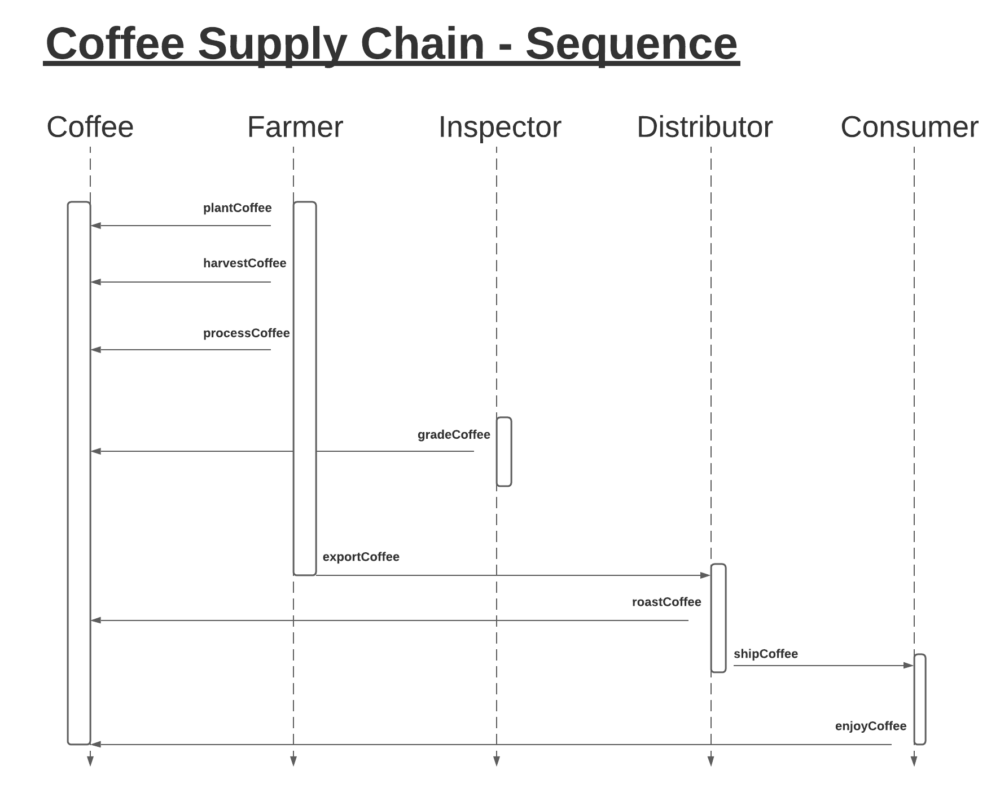

#Coffee Supply Chain

## Project Write-up
- Contract address
- Libraries uses and why adopted
- If IPFS, include how it is used
- Program version numbers
- NOde Version Number
- Truffle Version Number
- Web 3 version Number

## UML Docs
- State
- Class (data model)

### Activity Diagram

### Sequence Diagram
